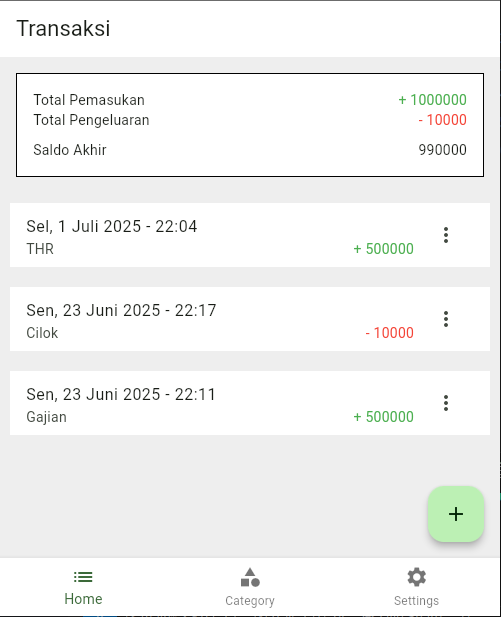

# UangSakuKu

Aplikasi dompet personal berbasis Flutter dengan Firebase untuk mencatat transaksi keuangan harian.



## Fitur

- Buat/menghapus memo transaksi
- Edit memo transaksi
- Tambah/edit kategori transaksi
- Ringkasan pemasukan & pengeluaran
- Terintegrasi dengan Firebase (Auth & Firestore)

## Instalasi

1. Pastikan Flutter terinstal (`flutter doctor`)
2. Clone repo:
   ```bash
   git clone https://github.com/username/UangSakuKu.git
   ```
3. Jalankan di vscode:
   ```bash
   flutter pub get
   ```
4. Kredensial Login
   ```bash
   Email : test@mail.com
   Pass  : test1234
   ```

## Tutorial

https://youtube.com/playlist?list=PLWkBNPANu7U80mRCvWpNWw6AwpbBiAorq&si=eo3eOvAfQim_cSM0
